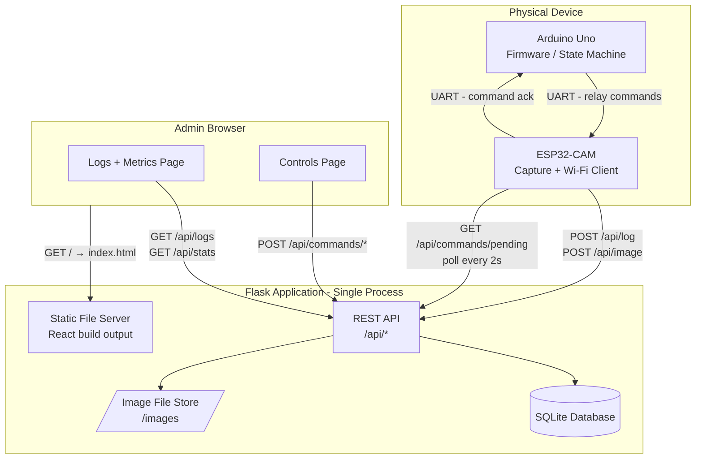
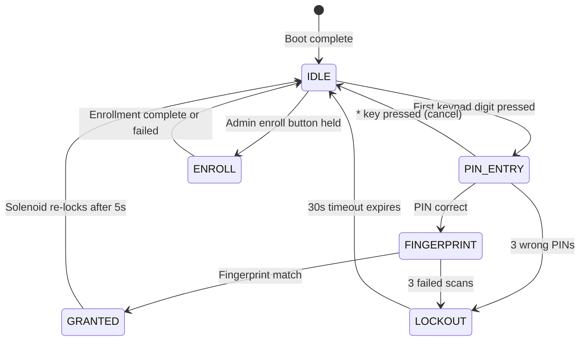
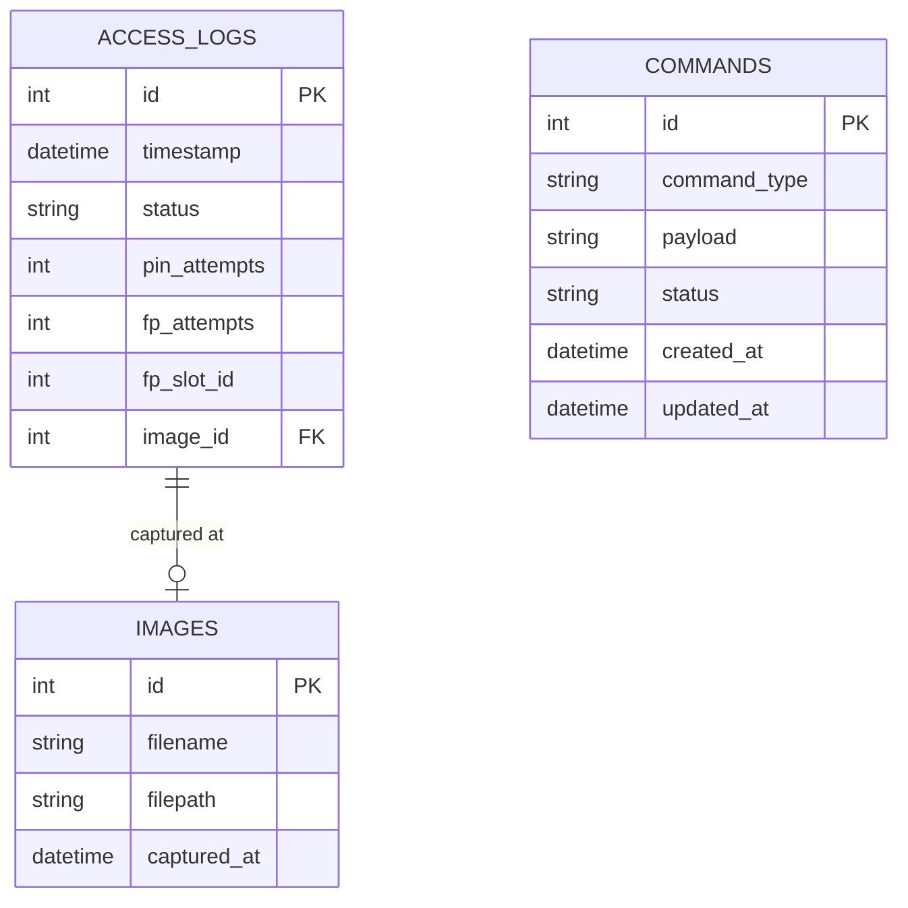
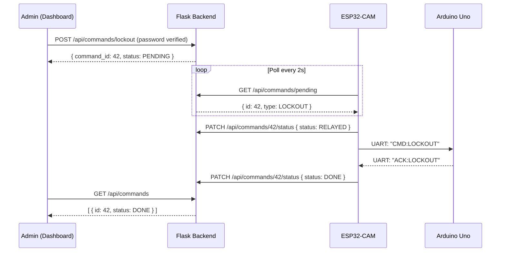
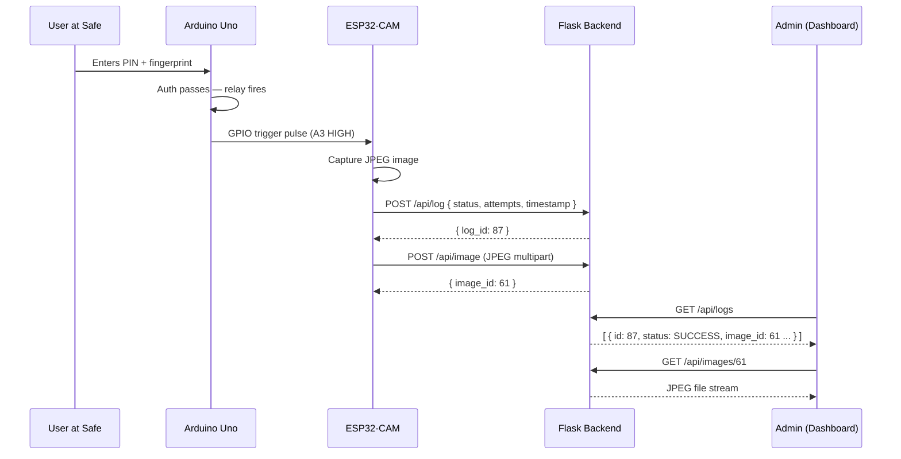

# SafeLock — Software Specification
**Project:** Microcontroller-Based Digital Safe Lock System  
**Version:** 1.1  
**Date:** May 2026  
**Status:** Pre-build / Planning

---

## 1. Overview

This document describes the complete software stack for a two-factor biometric safe lock system. The system uses an Arduino Uno as its physical controller and an ESP32-CAM for image capture and network communication. A single Flask application serves both the backend API and the compiled React admin dashboard, keeping deployment to one process on one port.

The software stack has three layers:

| Layer | Technology | Role |
|---|---|---|
| Firmware | Arduino C++ | Physical auth, peripheral control, state machine |
| Backend + Frontend Host | Python / Flask + SQLite | REST API, command queue, static file serving |
| Frontend | React + Tailwind CSS | Admin dashboard — Logs, Metrics, Controls |

---

## 2. System Architecture



---

## 3. Firmware — Arduino Uno

### 3.1 Responsibility

The Uno runs an event-driven state machine that handles all physical authentication and peripheral control. It does not connect to Wi-Fi — all network activity is delegated to the ESP32-CAM.

### 3.2 State Machine



### 3.3 Key Firmware Modules

| Module | Function |
|---|---|
| `keypad_driver` | Scans 4×4 matrix, debounces keypresses |
| `auth_controller` | Orchestrates PIN + fingerprint 2FA sequence |
| `fingerprint_driver` | UART comms with AS608 sensor (abstracted behind `verifyFingerprint()`) |
| `lock_controller` | Fires relay HIGH on auth success, closes after `SOLENOID_OPEN_MS` |
| `display_driver` | Writes status text to 16×2 LCD via I2C |
| `buzzer_driver` | Distinct tone patterns: success, error, lockout |
| `camera_trigger` | Sends HIGH pulse on A3 to wake ESP32-CAM |

### 3.4 Configurable Constants

```cpp
STORED_PIN          "1234"    // Move to EEPROM in production
PIN_LENGTH          4
MAX_ATTEMPTS        3         // Applies to both PIN and fingerprint
LOCKOUT_DURATION    30000     // ms — 30 seconds
SOLENOID_OPEN_MS    5000      // ms — lock stays open 5 seconds
CAM_PULSE_MS        200       // ms — trigger pulse width to ESP32-CAM
```

---

## 4. ESP32-CAM Module

### 4.1 Responsibility

The ESP32-CAM acts as the network bridge between the physical device and the Flask backend. It has two independent jobs running in its main loop:

**Push (event-driven):** When it receives a HIGH trigger pulse from the Uno, it captures a JPEG and posts both the access event and the image to the backend.

**Pull (time-driven):** Every 2 seconds it polls the backend for pending commands. If a command exists, it relays it to the Uno over UART and waits for acknowledgement before reporting the result back.

### 4.2 Communication Interfaces

| Interface | Direction | Used For |
|---|---|---|
| GPIO (trigger pin) | Input from Uno | Wakes image capture |
| UART (serial) | Bidirectional with Uno | Command relay and acknowledgement |
| HTTP POST | Outbound to Flask | Access logs and image upload |
| HTTP GET | Outbound to Flask | Pending command polling |

### 4.3 Required Configuration (ESP32-CAM Sketch)

```cpp
const char* WIFI_SSID     = "your_network_name";
const char* WIFI_PASSWORD = "your_password";
const char* BACKEND_HOST  = "192.168.1.100";  // Static IP of machine running Flask
const int   BACKEND_PORT  = 5000;             // Flask default port
const int   POLL_INTERVAL = 2000;             // ms
```

> **Important:** The machine running the Flask app must be assigned a static IP on the local router. If the IP changes, the ESP32-CAM loses its connection.

---

## 5. Backend — Flask

### 5.1 Responsibility

The Flask application is the single source of truth and the single running process for the entire software system. It does three things:

- Receives and stores all data coming from the ESP32-CAM
- Serves the REST API consumed by the admin dashboard
- Serves the compiled React frontend as static files

### 5.2 Tech Stack

| Component | Choice | Reason |
|---|---|---|
| Framework | Flask (Python) | Lightweight, simple routing, built-in static file serving |
| Database ORM | SQLAlchemy | Declarative models, works natively with Flask |
| Database | SQLite | Zero-config, file-based, sufficient for low write frequency |
| Image storage | Local filesystem `/images/` | Simple for project scope |
| Server | Flask dev server (dev) / Gunicorn (production) | Single process, single port |

### 5.3 Database Schema



**`access_logs.status` values:** `SUCCESS` | `FAIL_PIN` | `FAIL_FP` | `LOCKOUT`

**`commands.status` lifecycle:** `PENDING` → `RELAYED` → `ACKNOWLEDGED` → `DONE` | `FAILED`

**`commands.command_type` values:** `LOCKOUT` | `UNLOCK` | `ENROLL` | `UNENROLL` | `RESET`

### 5.4 API Endpoints

#### Inbound — from ESP32-CAM

| Method | Endpoint | Description |
|---|---|---|
| `POST` | `/api/log` | Receive access event (JSON) |
| `POST` | `/api/image` | Receive captured JPEG (multipart form) |
| `GET` | `/api/commands/pending` | Return oldest PENDING command or `null` |
| `PATCH` | `/api/commands/<id>/status` | Update command status |

#### Outbound — to Dashboard

| Method | Endpoint | Description |
|---|---|---|
| `GET` | `/api/logs` | Paginated log list, filterable by status |
| `GET` | `/api/logs/<id>` | Single log entry with full detail |
| `GET` | `/api/images/<id>` | Serve image file |
| `GET` | `/api/stats` | Aggregated metrics (counts, peak hours, streak) |
| `GET` | `/api/commands` | Full command queue history |
| `POST` | `/api/commands/lockout` | Queue LOCKOUT command |
| `POST` | `/api/commands/unlock` | Queue UNLOCK command |
| `POST` | `/api/commands/enroll` | Queue ENROLL command |
| `POST` | `/api/commands/unenroll` | Queue UNENROLL with slot ID payload |
| `POST` | `/api/commands/reset` | Queue RESET command |
| `GET` | `/api/device/status` | Return last seen timestamp + derived online status |

#### Frontend Catch-all

| Method | Endpoint | Description |
|---|---|---|
| `GET` | `/` and all non-`/api` routes | Serve `static/index.html` — React takes over routing |

### 5.5 Project Folder Structure

```
safelock/
├── app.py                  # Flask entry point — registers blueprints,
│                           # serves index.html for all non-API routes
├── database.py             # SQLAlchemy engine + session setup
├── models.py               # ORM models: AccessLog, Image, Command
├── routes/
│   ├── logs.py             # /api/log, /api/logs, /api/logs/<id>
│   ├── images.py           # /api/image, /api/images/<id>
│   ├── commands.py         # /api/commands/*
│   ├── stats.py            # /api/stats
│   └── device.py           # /api/device/status
├── static/                 # React build output — populated by npm run build
│   ├── index.html
│   └── assets/
├── frontend/               # React source — developed separately, built into static/
│   ├── src/
│   ├── package.json
│   └── vite.config.js
├── images/                 # Uploaded JPEG files (gitignored)
├── safe.db                 # SQLite database file (gitignored)
└── requirements.txt
```

### 5.6 Frontend Build + Serve Pattern

During development, the React dev server runs independently on port `5173` (Vite default) and proxies API calls to Flask on port `5000`. For deployment and demo:

```bash
# Step 1 — build the React app
cd frontend && npm run build

# Step 2 — output lands in safelock/static/
# Step 3 — run Flask
cd .. && flask run

# Everything now lives at http://192.168.1.100:5000
```

Flask's catch-all route handles React Router navigation:

```python
@app.route("/", defaults={"path": ""})
@app.route("/<path:path>")
def serve_react(path):
    if path.startswith("api"):
        return {"error": "not found"}, 404
    return send_from_directory(app.static_folder, "index.html")
```

---

## 6. Frontend — React Dashboard

### 6.1 Responsibility

A desktop-only admin interface (minimum 1280px width) for monitoring the safe and sending control commands. Dark-themed, data-dense, modelled after tools like Vercel and Grafana.

### 6.2 Tech Stack

| Component | Choice |
|---|---|
| Framework | React 18 |
| Build tool | Vite |
| Styling | Tailwind CSS |
| HTTP client | Axios (base URL points to Flask on port `5000`) |
| Charts | Recharts |
| State management | React Context + `useState` / `useEffect` |

### 6.3 Page Structure

```
SafeAdmin
├── Sidebar (persistent)
│   ├── Logo / product name
│   ├── Nav: Logs (default)
│   └── Nav: Controls
│
├── Logs Page
│   ├── MetricsCard (collapsible)
│   │   ├── Stat tiles: Total Today, Successes, Failures, Lockouts
│   │   ├── Hourly bar chart (peak access hours)
│   │   └── Longest consecutive fail streak
│   └── AccessLogTable
│       ├── Search bar + status filter dropdown
│       ├── CSV export button
│       └── Columns: Timestamp | Status badge | Image thumbnail |
│                    PIN attempts | FP attempts | FP slot ID
│
└── Controls Page
    ├── Left column — Action Cards
    │   ├── DeviceStatusCard
    │   │   └── Status pill (Online / Offline / Locked Out)
    │   │       + Last seen timestamp + Refresh button
    │   ├── EnrollCard
    │   │   └── Trigger button → shows "Waiting for physical scan..."
    │   ├── UnenrollCard
    │   │   └── Slot ID dropdown (0–127) + Remove button
    │   ├── LockoutToggleCard
    │   │   └── Toggle (red = locked, green = normal)
    │   │       Requires admin password confirmation
    │   └── DeviceResetCard (danger zone — red border)
    │       └── Type "RESET" to enable confirm button
    │
    └── Right column — CommandQueuePanel
        └── Live list: command name | time sent | status badge
            PENDING (grey) | RELAYED (blue) | ACKNOWLEDGED (yellow)
            DONE (green) | FAILED (red)
```

### 6.4 Admin Authentication

Controls are password-protected at the client level. No server-side session is required — this is a single-admin, local-network tool.

```
Admin enters password
→ Frontend hashes input with SHA-256
→ Compares against stored hash in localStorage (set on first launch)
→ If match: POST fires to Flask API
→ If no match: request never leaves the browser
```

### 6.5 Data Refresh Strategy

| Panel | Refresh Method | Interval |
|---|---|---|
| Logs table | Polling | Every 10 seconds |
| Metrics card | Polling | Every 30 seconds |
| Command queue | Polling | Every 3 seconds |
| Device status | On-demand | Refresh button only |

### 6.6 Vite Proxy Configuration (Development Only)

During development, Vite proxies API calls to Flask so CORS is not an issue:

```javascript
// vite.config.js
export default {
  server: {
    proxy: {
      "/api": "http://localhost:5000"
    }
  }
}
```

In the built/deployed app, the React code and Flask API are on the same origin (`http://192.168.1.100:5000`), so no proxy or CORS configuration is needed at all.

---

## 7. Command Flow — End to End



---

## 8. Access Event Flow — End to End



---

## 9. Configuration Checklist

| Layer | Item | Where |
|---|---|---|
| Uno firmware | `STORED_PIN` value | `safe_lock.ino` constant |
| Uno firmware | `SOLENOID_OPEN_MS` timing | `safe_lock.ino` constant |
| ESP32-CAM sketch | Wi-Fi SSID + password | Sketch constants |
| ESP32-CAM sketch | Flask machine static IP + port `5000` | Sketch constants |
| Router | Static IP assigned to Flask machine | Router DHCP settings |
| Flask backend | Database path | `database.py` |
| Flask backend | Image storage path | `routes/images.py` |
| React frontend | Vite proxy target (dev only) | `vite.config.js` |
| React frontend | Admin password (first launch) | Set via setup screen, stored as SHA-256 hash in localStorage |

---

## 10. Build Order

```
Phase 1 — Firmware (complete)
  ✓ Arduino state machine + all peripheral drivers
  ✓ Wokwi simulation diagram

Phase 2 — Flask Backend
  [ ] Project scaffold + SQLAlchemy models
  [ ] Inbound endpoints (log, image, command polling)
  [ ] Outbound endpoints (logs, stats, commands)
  [ ] Image file storage handler
  [ ] React catch-all route + static folder wiring

Phase 3 — ESP32-CAM Sketch
  [ ] Wi-Fi connection + reconnect logic
  [ ] HTTP POST for log and image to Flask
  [ ] Command poll loop + UART relay to Uno

Phase 4 — Frontend
  [ ] Vite + React + Tailwind scaffold
  [ ] Logs page — table + filters + export
  [ ] Metrics card — stat tiles + chart
  [ ] Controls page — action cards + command queue
  [ ] Admin password gate
  [ ] npm run build → output to safelock/static/

Phase 5 — Integration
  [ ] Full end-to-end test on local network (single flask run command)
  [ ] Static IP configuration on router
  [ ] Hardware build + real fingerprint sensor swap-in
```

---

*Document covers firmware v1.0, Flask backend v1.1, and dashboard v1.1. All component names, endpoint paths, and schema field names are implementation-ready and should be used verbatim across all layers for consistency.*